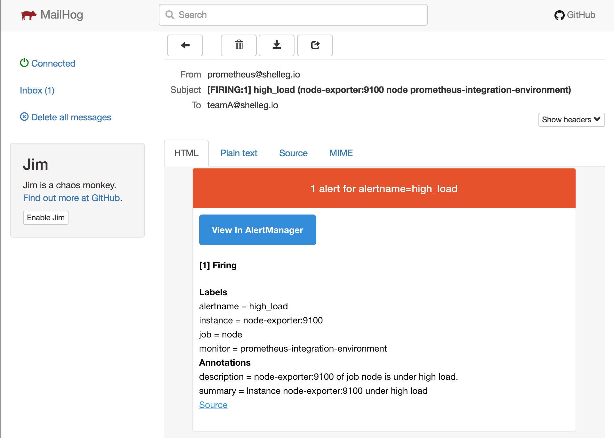
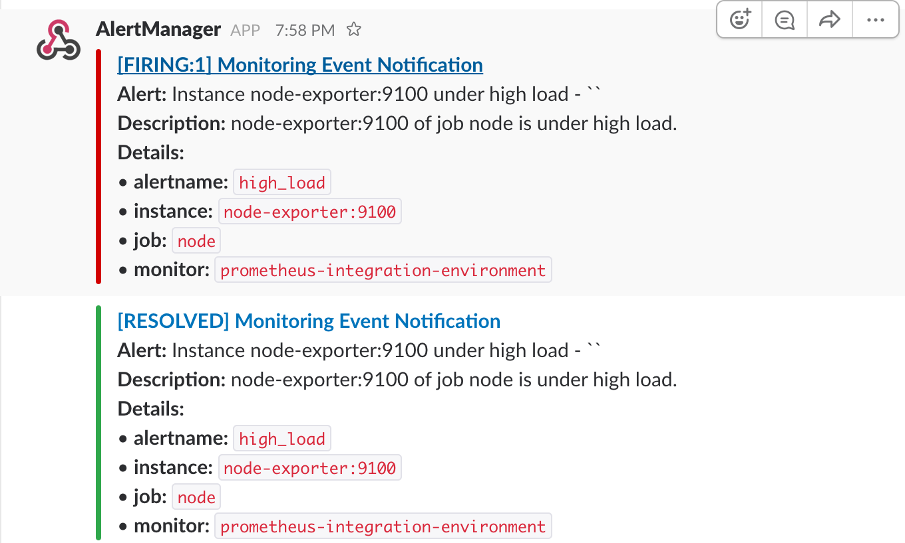

## Make an alert || force an alert

To setup slack just replace the slack webhook url in the `alertmanager/config.yml` - more info on how to do that [at this link](https://www.robustperception.io/using-slack-with-the-alertmanager/)

To simulate an alert with our setup ... just stop one of the services (except the `alertmanager` of course ;)) so something like:

`docker stop prometheusstack_mysql-exporter_1` which, will stop the mysql-exporter and make the alert named `service_down` to fire ...

Checkout [Mailhog](http://{{book.prometheus_demo_hostname}}:{{book.mailhog_port}}/) and slack for final results such as:

* Mailhog:

* Slack:

