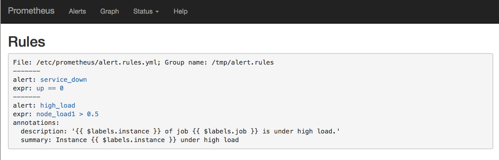

# Sample alerts / rules:

```yaml
groups:
- name: /tmp/alert.rules
  rules:
  - alert: service_down
    expr: up == 0
  - alert: high_load
    expr: node_load1 > 0.5
    annotations:
      description: '{{ $labels.instance }} of job {{ $labels.job }} is under high
        load.'
      summary: Instance {{ $labels.instance }} under high load
```

