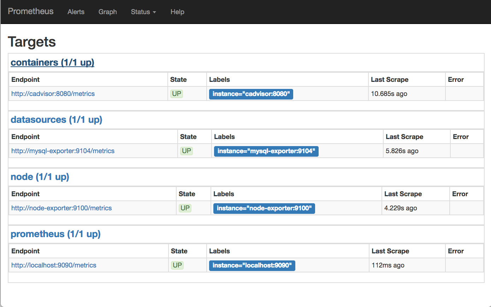

# Predefined Configuration:

From the [docker-compose.yml](../docker-compose.yml) assuming all the below services are deployed you will funding the following static configuration:

```sh
scrape_configs:

  - job_name: 'prometheus'
    static_configs:
      - targets: ['localhost:9090']

  - job_name: 'containers'
    static_configs:
      - targets: ['cadvisor:8080']

  - job_name: 'node'
    static_configs:
      - targets: [ 'node-exporter:9100' ]

  - job_name: 'datasources'
    static_configs:
      - targets: ['mysql-exporter:9104']
```
*see full configuration under __./prometheus/prometheus.yml__*

A fully deployed stack with the /tagets suffix would show the following:

